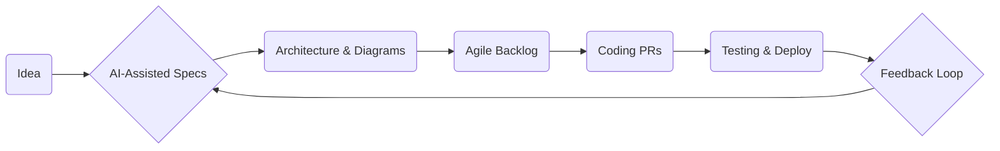

# AI-Driven Product Development Workflow

## 1. Vision & Philosophy
Harness artificial intelligence as an accelerator throughout the software lifecycle. Humans own strategic thinking, complex trade-offs, and final accountability; AI operates as a tireless junior-to-mid developer that executes, learns, and continuously improves under human guidance.

## 2. Core Roles
| Role | Primary Responsibilities |
|------|--------------------------|
| **Architect / DevOps Lead (You)** | • Translate business goals into technical vision. • Define architecture and DevOps strategy. • Curate and refine requirements. • Orchestrate feedback loop and workflow improvements. |
| **AI Assistant** | • Draft detailed specifications. • Generate boilerplate code, tests, configs. • Execute repetitive tasks (refactors, docs). • Analyze failures and suggest improvements. |
| **Stakeholders** | • Provide business context. • Review deliverables and give feedback. |

## 3. End-to-End Workflow Overview
1. **Ideation → Specification**  
   Translate business idea into exhaustive requirements using AI prompts & templates.
2. **Architecture Definition**  
   Drive high-level design, select tech stack, create diagrams. Use AI to explore options.
3. **Backlog Creation**  
   Decompose specs into granular Agile artefacts (Epics → Stories → Tasks) with acceptance criteria.
4. **Development**  
   AI generates code via pull requests; human reviews, merges, deploys.
5. **Feedback & Learning**  
   Capture failures, retro insights, metrics; feed into AI to refine future specs.
6. **Continuous Improvement**  
   Iterate on tooling, architecture choices, and workflow based on data.

## 4. Requirements Specification Best Practices
1. **Structured Templates**: Title, Context, Problem, Non-Functional Reqs, Constraints, Edge Cases.
2. **AI-Generated Detail**: Prompt AI to enumerate user journeys, data models, error states.
3. **Acceptance Criteria (Gherkin)**: Given-When-Then for every scenario.
4. **Traceability**: Link each requirement ↔ test case ↔ code module.

## 5. Git Strategy & Pull Requests
- **Branches**: `main` (prod), `dev` (integration), feature branches `feat/<ticket-id>`.
- **PR Template**: Summary, linked issue, checklist (tests, docs, screenshots).
- **Review Gates**: CI green, 1 human approval, AI static analysis.

## 6. Architecture Excellence
- **Decision Records (ADR)**: Capture rationale for tech choices.
- **Modular Design**: Domain-driven boundaries enabling independent deployment.
- **Scalability & Observability**: Incorporate metrics, tracing, autoscaling from day 1.
- **AI Support**: Prompt AI to compare patterns, generate ADR drafts, and update diagrams.

## 7. DevOps Automation
- IaC (Terraform, Pulumi) generated & maintained via AI.
- CI/CD pipelines that run lint, tests, SCA, build, deploy.
- ChatOps commands to trigger builds, rollbacks, migrations.

## 8. Feedback Loop & Continuous Learning
| Input | Tooling | Output |
|-------|---------|--------|
| Production incidents | Post-mortems, logs | New tests, spec updates |
| Code review comments | PR analytics bots | AI prompt tweaks |
| User analytics | BI dashboards | Roadmap adjustments |

Use retrospectives every sprint to formalize lessons and update:
- Spec templates
- Prompt libraries
- Architectural standards

## 9. Adopting New Technologies
1. **Radar Tracking**: Maintain a tech radar; review quarterly with AI assistance.
2. **Spike Tickets**: Time-boxed research with success criteria.
3. **Decision Workshops**: Human + AI SWOT analysis before adoption.

## 10. Measuring Success
- Lead time from idea → production.
- Defect escape rate.
- Deployment frequency.
- AI contribution ratio (lines or tasks).
- Stakeholder satisfaction survey.

## 11. Getting Started Checklist
- [ ] Set up shared prompt library in repo `/ai/prompts/`.
- [ ] Create `ISSUE_TEMPLATE.md` and `PULL_REQUEST_TEMPLATE.md`.
- [ ] Bootstrap mono-repo with sample service.
- [ ] Configure CI/CD with automated tests.
- [ ] Schedule first retro to review workflow efficacy.

---
*Living document – revisit after every major release to incorporate new insights and refine the AI-augmented development practice.*